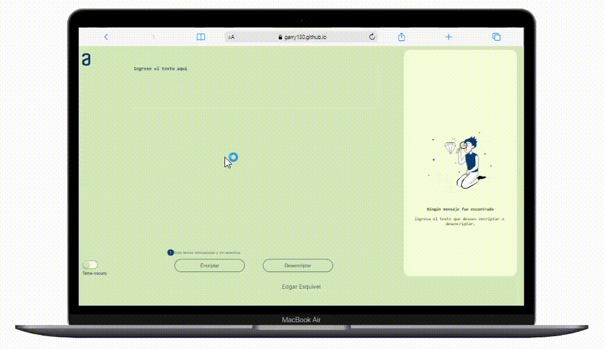

# ENCRIPTADOR DE TEXTO - ALURA

## Intorducción

Es un proyecto propuesto por Alura Latam y forma parte del curso Oracle Next Education (ONE)

Nuestra aplicacion permite al usuario cifrar y decifrar texto, con la finalidad compartir y recibir mensajes secretos. 

## Índice

* [Encriptador de texto](#encriptador-de-texto---alura)
  - [Introducción](#intorducción)
  - [Índice](#índice)
  - [Descripción](#descripción-del-proyecto)
  - [Estado del Proyecto](#estado-del-proyecto)
  - [Demostracion](#demostración)
  - [Acceso al proyecto](#acceso-al-proyecto)
  - [Tecnologias utilizadas](#tecnologías-utilizadas)
  - [Contribuyentes](#personas-contribuyentes)
  - [Desarrolladores](#personas-desarrolladoras-del-proyecto)

## Descripción del Proyecto

Encriptador de texto con JavaScript

La aplicación puede encripta textos, con el fin de intercambiar mensajes secretos con otras personas que sepan el secreto de la encriptación utilizada.

- **Epecifiaciones**

  - Solo funciona con letras minúsculas
  - No deben ser utilizados letras con acentos ni caracteres especiales
  - Puede encriptar una palabra y tambien puede devolverl la palabra encriptada a la version original.

- Las "llaves" de encriptación que utilizadas son las siguientes:

  - La letra "e" es convertida para "enter"
  - La letra "i" es convertida para "imes"
  - La letra "a" es convertida para "ai"
  - La letra "o" es convertida para "ober"
  - La letra "u" es convertida para "ufat"

La página contiene los siguientes campos

- Un boton para activar el **Tema oscuro**
- **Inserción** del texto que será encriptado o desencriptado
  - Un botón **Encriptar** para cifrar el texto
  - Un botón **Desencriptar** para descifrar el texto
- **Mensaje** para mostrar los resutados
  - Un botón **Copiar** para el texto encriptado /desencriptado en la sección de **Mensaje**
- Una ventana Emergente de **Alerta** que se activa al detectar letras mayusculas
  - Un boton **Cerrar** para la ventana **Alerta**
  - Un boton **minuscula** para darle la oportunidad al usuario de convertir su texto a minusculas

## Estado del proyecto:

En Desarrollo

## Demostración

## Acceso al Proyecto

Para poder ejecutar la palicacion da __[click aqui](https://garry130.github.io/encirptador-alura/)__ 

## Tecnologías utilizadas

* HTML
* css
* JavaScript
* VS Code

## Personas Contribuyentes

* __Diseño:__  Equipo Alura Latam
  
## Personas Desarrolladoras del Proyecto

* __Desarrollo:__ Edgar Esquivel